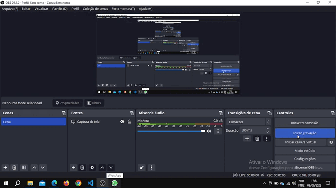

<h1>CRUD de Usuários - Projeto Web Full Stack</h1>

  

## 📒 Descrição

Este é o meu trabalho da disciplina de Laboratório Web onde resolvi desenvolver um CRUD Full Stack. É possivel que os usuários cadastrem suas informações básicas, como nome, email e telefone, através de um formulário. Esses dados são armazenados em um banco de dados MySQL e exibidos em uma tabela na página principal. Os usuários também podem atualizar ou excluir seus dados conforme necessário.